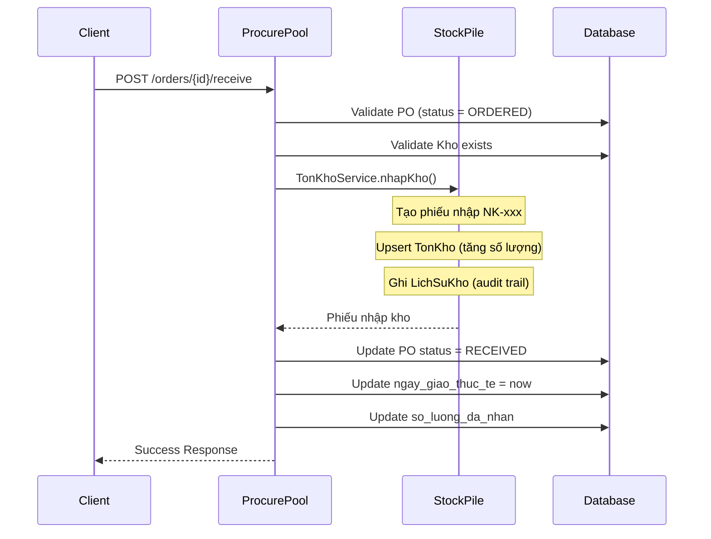

# Phase 10: ProcurePool - Procurement Management API Test

## Tổng quan

Module **ProcurePool** quản lý quy trình mua sắm B2B:
- **Nhà cung cấp (NhaCungCap)**: CRUD Supplier Management
- **Đơn đặt hàng NCC (DonDatHangNcc)**: Purchase Order Management
- **Quy trình nhập hàng**: PO → Goods Receipt ( Integration với StockPile)

## Authentication

Tất cả API yêu cầu JWT Bearer Token:
```
Authorization: Bearer {access_token}
```

---

## PHẦN 1: SUPPLIER MANAGEMENT (NHÀ CUNG CẤP)

### 1.1 Tạo nhà cung cấp mới

```http
POST /api/nha-cung-cap
Content-Type: application/json
Authorization: Bearer {token}

{
  "ten_nha_cung_cap": "Công ty TNHH Thiết bị Điện lạnh ABC",
  "ma_ncc": "NCC-001",
  "nguoi_lien_he": "Nguyễn Văn A",
  "email": "contact@abc-dienlanh.com",
  "so_dien_thoai": "0901234567",
  "dia_chi": "123 Nguyễn Huệ, Q1, TP.HCM",
  "ma_so_thue": "0123456789",
  "so_tai_khoan": "1234567890123",
  "ngan_hang": "Vietcombank - CN TP.HCM",
  "ghi_chu": "NCC uy tín, giao hàng đúng hẹn"
}
```

**Response 201:**
```json
{
  "id": "uuid-ncc",
  "ma_ncc": "NCC-001",
  "ten_nha_cung_cap": "Công ty TNHH Thiết bị Điện lạnh ABC",
  "nguoi_lien_he": "Nguyễn Văn A",
  "email": "contact@abc-dienlanh.com",
  "so_dien_thoai": "0901234567",
  "dia_chi": "123 Nguyễn Huệ, Q1, TP.HCM",
  "ma_so_thue": "0123456789",
  "so_tai_khoan": "1234567890123",
  "ngan_hang": "Vietcombank - CN TP.HCM",
  "ghi_chu": "NCC uy tín, giao hàng đúng hẹn",
  "trang_thai": 1,
  "ngay_tao": "2026-01-07T10:00:00.000Z",
  "ngay_cap_nhat": "2026-01-07T10:00:00.000Z"
}
```

### 1.2 Danh sách nhà cung cấp

```http
GET /api/nha-cung-cap?page=1&limit=10&search=ABC&trang_thai=1
Authorization: Bearer {token}
```

**Query Parameters:**
| Param | Type | Description |
|-------|------|-------------|
| page | number | Trang (default: 1) |
| limit | number | Số lượng/trang (default: 10, max: 100) |
| search | string | Tìm theo tên, mã, email, SĐT |
| trang_thai | number | 1: Hoạt động, 0: Ngưng |
| sortBy | string | Sắp xếp theo trường (default: ngay_tao) |
| sortOrder | 'asc' \| 'desc' | Thứ tự (default: desc) |

**Response 200:**
```json
{
  "data": [
    {
      "id": "uuid-ncc",
      "ma_ncc": "NCC-001",
      "ten_nha_cung_cap": "Công ty ABC",
      "trang_thai": 1,
      "ngay_tao": "2026-01-07T10:00:00.000Z"
    }
  ],
  "meta": {
    "page": 1,
    "limit": 10,
    "total": 15,
    "totalPages": 2
  }
}
```

### 1.3 Danh sách NCC đang hoạt động (Dropdown)

```http
GET /api/nha-cung-cap/active
Authorization: Bearer {token}
```

**Response 200:** Mảng NCC không phân trang
```json
[
  {
    "id": "uuid-ncc-1",
    "ma_ncc": "NCC-001",
    "ten_nha_cung_cap": "Công ty ABC",
    "so_dien_thoai": "0901234567",
    "email": "contact@abc.com"
  }
]
```

### 1.4 Chi tiết nhà cung cấp

```http
GET /api/nha-cung-cap/{id}
Authorization: Bearer {token}
```

**Response 200:** Full thông tin + `_count.don_dat_hang_ncc`

### 1.5 Cập nhật nhà cung cấp

```http
PUT /api/nha-cung-cap/{id}
Content-Type: application/json
Authorization: Bearer {token}

{
  "ten_nha_cung_cap": "Công ty ABC (Updated)",
  "trang_thai": 0
}
```

### 1.6 Xóa nhà cung cấp (Soft Delete)

```http
DELETE /api/nha-cung-cap/{id}
Authorization: Bearer {token}
```

**Lưu ý:** Không xóa được NCC có đơn hàng đang xử lý (DRAFT, ORDERED)

### 1.7 Khôi phục nhà cung cấp

```http
PATCH /api/nha-cung-cap/{id}/restore
Authorization: Bearer {token}
```

### 1.8 Thống kê NCC

```http
GET /api/nha-cung-cap/count
Authorization: Bearer {token}
```

**Response 200:**
```json
{
  "tong": 15,
  "hoat_dong": 12,
  "ngung_hoat_dong": 3
}
```

---

## PHẦN 2: PURCHASE ORDER MANAGEMENT (ĐƠN ĐẶT HÀNG NCC)

### 2.1 Trạng thái đơn hàng (Enum)

| Value | Name | Description |
|-------|------|-------------|
| 0 | DRAFT | Nháp - Chưa gửi cho NCC |
| 1 | ORDERED | Đã đặt - Đang chờ giao hàng |
| 2 | RECEIVED | Đã nhận - Hoàn thành nhập kho |
| 3 | CANCELLED | Đã hủy |

### 2.2 Tạo đơn đặt hàng (PO)

```http
POST /api/procure-pool/orders
Content-Type: application/json
Authorization: Bearer {token}

{
  "nha_cung_cap_id": "uuid-ncc",
  "ma_don_hang": "PO-2026-001",
  "ngay_giao_du_kien": "2026-01-15",
  "ghi_chu": "Giao hàng buổi sáng",
  "trang_thai": 0,
  "items": [
    {
      "san_pham_id": "uuid-sp-1",
      "so_luong": 10,
      "don_gia": 150000,
      "ghi_chu": "Màu trắng"
    },
    {
      "san_pham_id": "uuid-sp-2",
      "so_luong": 5,
      "don_gia": 250000
    }
  ]
}
```

**Validation:**
- `so_luong` > 0 (bắt buộc)
- `don_gia` >= 0 (bắt buộc)
- `items` phải có ít nhất 1 sản phẩm
- `trang_thai` chỉ nhận DRAFT (0) hoặc ORDERED (1)

**Response 201:**
```json
{
  "id": "uuid-po",
  "ma_don_hang": "PO-2026-001",
  "id_nha_cung_cap": "uuid-ncc",
  "ngay_dat": null,
  "ngay_giao_du_kien": "2026-01-15T00:00:00.000Z",
  "tong_tien": 2750000,
  "trang_thai": 0,
  "ghi_chu": "Giao hàng buổi sáng",
  "nha_cung_cap": {
    "id": "uuid-ncc",
    "ma_ncc": "NCC-001",
    "ten_nha_cung_cap": "Công ty ABC",
    "so_dien_thoai": "0901234567"
  },
  "chi_tiet_don_dat_hang": [
    {
      "id": "uuid-ct-1",
      "id_san_pham": "uuid-sp-1",
      "ten_san_pham": "Gas R32",
      "so_luong": 10,
      "don_gia": 150000,
      "thanh_tien": 1500000,
      "so_luong_da_nhan": 0,
      "san_pham": {
        "id": "uuid-sp-1",
        "ma_san_pham": "SP-001",
        "ten_san_pham": "Gas R32",
        "don_vi_tinh": "Bình"
      }
    }
  ],
  "ngay_tao": "2026-01-07T10:00:00.000Z"
}
```

### 2.3 Danh sách đơn đặt hàng

```http
GET /api/procure-pool/orders?page=1&limit=10&nha_cung_cap_id=uuid&trang_thai=1&tu_ngay=2026-01-01&den_ngay=2026-01-31
Authorization: Bearer {token}
```

**Query Parameters:**
| Param | Type | Description |
|-------|------|-------------|
| page | number | Trang |
| limit | number | Số lượng/trang |
| search | string | Tìm theo mã đơn |
| nha_cung_cap_id | UUID | Lọc theo NCC |
| trang_thai | number | 0-3 (xem enum) |
| tu_ngay | date | Từ ngày tạo |
| den_ngay | date | Đến ngày tạo |

### 2.4 Chi tiết đơn đặt hàng

```http
GET /api/procure-pool/orders/{id}
Authorization: Bearer {token}
```

### 2.5 Cập nhật đơn đặt hàng (Chỉ DRAFT)

```http
PUT /api/procure-pool/orders/{id}
Content-Type: application/json
Authorization: Bearer {token}

{
  "ngay_giao_du_kien": "2026-01-20",
  "ghi_chu": "Cập nhật: Giao chiều",
  "items": [
    {
      "san_pham_id": "uuid-sp-1",
      "so_luong": 15,
      "don_gia": 145000
    }
  ]
}
```

**Lưu ý:** Nếu có `items`, sẽ **thay thế toàn bộ** chi tiết cũ

### 2.6 Xác nhận đơn hàng (DRAFT → ORDERED)

```http
POST /api/procure-pool/orders/{id}/confirm
Content-Type: application/json
Authorization: Bearer {token}

{
  "ngay_dat": "2026-01-10"
}
```

**Logic:**
- Chuyển trạng thái từ `DRAFT` sang `ORDERED`
- Ghi nhận `ngay_dat` (mặc định: now)

**Response 200:** Full PO với trạng thái mới

---

## PHẦN 3:  NHẬN HÀNG (GOODS RECEIPT) - KEY INTEGRATION

### 3.1 API Nhận hàng

```http
POST /api/procure-pool/orders/{id}/receive
Content-Type: application/json
Authorization: Bearer {token}

{
  "kho_nhap_id": "uuid-kho",
  "ghi_chu": "Kiểm tra OK, đủ số lượng"
}
```

### 3.2 Logic xử lý (Transaction)



### 3.3 Response 200

```json
{
  "message": "Nhận hàng thành công",
  "don_dat_hang": {
    "id": "uuid-po",
    "ma_don_hang": "PO-2026-001",
    "trang_thai": 2,
    "ngay_giao_thuc_te": "2026-01-12T15:30:00.000Z",
    "kho": {
      "id": "uuid-kho",
      "ten_kho": "Kho chính - Văn phòng HCM"
    },
    "chi_tiet_don_dat_hang": [
      {
        "id": "uuid-ct",
        "so_luong": 10,
        "so_luong_da_nhan": 10
      }
    ]
  },
  "phieu_nhap_kho": {
    "ma_phieu": "NK-1704585600000",
    "loai_phieu": "nhap",
    "so_items": 2,
    "tong_so_luong": 15,
    "ly_do": "Nhận hàng từ đơn PO: PO-2026-001",
    "ngay_tao": "2026-01-12T15:30:00.000Z"
  }
}
```

### 3.4 Validation Rules

| Check | Error Message |
|-------|---------------|
| PO không tồn tại | "Không tìm thấy đơn đặt hàng với ID: xxx" |
| PO không phải ORDERED | "Chỉ có thể nhận hàng cho đơn ở trạng thái Đã đặt (ORDERED)" |
| Kho không tồn tại | "Không tìm thấy kho với ID: xxx" |
| Không có sản phẩm hợp lệ | "Không có sản phẩm hợp lệ để nhập kho" |

---

## PHẦN 4: HỦY ĐƠN HÀNG

### 4.1 Hủy đơn

```http
POST /api/procure-pool/orders/{id}/cancel
Content-Type: application/json
Authorization: Bearer {token}

{
  "ly_do_huy": "NCC không còn hàng"
}
```

**Điều kiện:** Chỉ hủy được đơn `DRAFT` hoặc `ORDERED`

**Response 200:** PO với trạng thái `CANCELLED` (3)

### 4.2 Xóa đơn (Soft Delete)

```http
DELETE /api/procure-pool/orders/{id}
Authorization: Bearer {token}
```

**Điều kiện:** Chỉ xóa được đơn `DRAFT` hoặc `CANCELLED`

---

## PHẦN 5: THỐNG KÊ

### 5.1 Thống kê đơn đặt hàng

```http
GET /api/procure-pool/orders/stats
Authorization: Bearer {token}
```

**Response 200:**
```json
{
  "tong_don_hang": 50,
  "don_nhap": 5,
  "don_dang_cho": 12,
  "don_da_nhan": 30,
  "don_da_huy": 3,
  "tong_gia_tri": 125000000
}
```

---

## PHẦN 6: ERROR RESPONSES

### 6.1 400 Bad Request

```json
{
  "statusCode": 400,
  "message": "Chỉ có thể nhận hàng cho đơn ở trạng thái Đã đặt (ORDERED)",
  "error": "Bad Request"
}
```

### 6.2 404 Not Found

```json
{
  "statusCode": 404,
  "message": "Không tìm thấy nhà cung cấp với ID: xxx",
  "error": "Not Found"
}
```

### 6.3 Validation Error

```json
{
  "statusCode": 400,
  "message": [
    "Số lượng phải lớn hơn 0",
    "Đơn giá không được âm"
  ],
  "error": "Bad Request"
}
```

---

## PHẦN 7: WORKFLOW DIAGRAM

```
┌─────────────────────────────────────────────────────────────────────┐
│                    PROCUREMENT WORKFLOW                              │
├─────────────────────────────────────────────────────────────────────┤
│                                                                      │
│  ┌──────────┐    POST /orders      ┌──────────┐                    │
│  │          │ ─────────────────────►│          │                    │
│  │  START   │                       │  DRAFT   │                    │
│  │          │                       │   (0)    │                    │
│  └──────────┘                       └────┬─────┘                    │
│                                          │                          │
│                    POST /orders/:id/confirm                         │
│                                          │                          │
│                                          ▼                          │
│                                    ┌──────────┐                    │
│                                    │          │                    │
│                                    │ ORDERED  │                    │
│                                    │   (1)    │                    │
│                                    └────┬─────┘                    │
│                                          │                          │
│            POST /orders/:id/receive      │                          │
│            ( Integration StockPile)    │                          │
│                                          ▼                          │
│  ┌──────────┐                      ┌──────────┐                    │
│  │          │◄─────────────────────│          │                    │
│  │CANCELLED │  POST /cancel        │ RECEIVED │                    │
│  │   (3)    │  (from DRAFT/ORDERED)│   (2)    │                    │
│  └──────────┘                      └──────────┘                    │
│                                                                      │
└─────────────────────────────────────────────────────────────────────┘
```

---

## PHẦN 8: TEST SCENARIOS

### Scenario 1: Tạo PO và nhận hàng đầy đủ

```bash
# 1. Tạo NCC
POST /api/nha-cung-cap
# -> uuid-ncc

# 2. Tạo PO (DRAFT)
POST /api/procure-pool/orders
{
  "nha_cung_cap_id": "uuid-ncc",
  "items": [{ "san_pham_id": "uuid-sp", "so_luong": 10, "don_gia": 100000 }]
}
# -> uuid-po, trang_thai: 0

# 3. Xác nhận đơn
POST /api/procure-pool/orders/{uuid-po}/confirm
# -> trang_thai: 1 (ORDERED)

# 4. Nhận hàng
POST /api/procure-pool/orders/{uuid-po}/receive
{
  "kho_nhap_id": "uuid-kho"
}
# -> trang_thai: 2 (RECEIVED)
# -> Tồn kho tăng 10 đơn vị
# -> Phiếu nhập NK-xxx được tạo
```

### Scenario 2: Tạo PO nhanh (bỏ qua DRAFT)

```bash
POST /api/procure-pool/orders
{
  "nha_cung_cap_id": "uuid-ncc",
  "trang_thai": 1,  # Tạo luôn ORDERED
  "items": [...]
}
# -> Tạo đơn với ngay_dat = now, trang_thai = 1
```

### Scenario 3: Hủy đơn đang chờ

```bash
POST /api/procure-pool/orders/{uuid-po}/cancel
{
  "ly_do_huy": "NCC báo hết hàng"
}
# -> trang_thai: 3 (CANCELLED)
```

---

## PHẦN 9: INTEGRATION NOTES

### 9.1 Module Dependencies

```typescript
// procurepool.module.ts
@Module({
  imports: [
    forwardRef(() => StockPileModule), // Để dùng TonKhoService
  ],
  // ...
})
export class ProcurePoolModule {}
```

### 9.2 Nguồn nhập kho

Khi nhận hàng từ PO, hệ thống gọi `TonKhoService.nhapKho()` với:
- `nguon_nhap`: `DON_HANG_NCC`
- `ly_do`: `Nhận hàng từ đơn PO: {ma_don_hang}`

### 9.3 Audit Trail

Mọi biến động tồn kho từ PO đều được ghi nhận trong `LichSuKho`:
- `loai_phieu`: `nhap`
- `ma_phieu`: `NK-{timestamp}`

---

*Document Version: 1.0*
*Phase 10: ProcurePool - Procurement Management*
*Last Updated: 2026-01-07*
